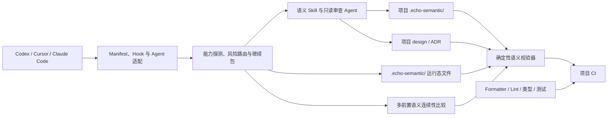
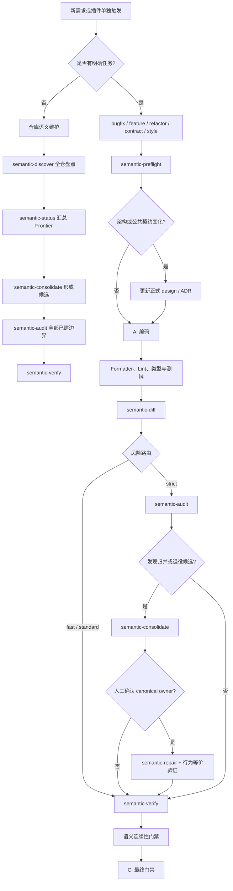

# Echo Semantic

`echo-semantic` 是面向 Coding Agent 的项目无关语义治理插件。它把仓库级语义维护、生成前预检、语义基线、
资产盘点、候选归并、增量影响分析、受控修复、定向审查和确定性验证组合成一条可按风险升级的开发链路，并适配 Codex、Cursor 和 Claude Code。

插件不替代 formatter、Lint、类型检查、单元测试、契约测试或集成测试。Skill 负责需要判断的工作，Hook 负责
生命周期接线，校验器和 CI 负责确定性阻断。

> 当前版本：`0.2.0`。本版本完成语义资产盘点、候选归并、受控删除和行为等价验证；Codex 本地安装与 Cursor 窗口检查已完成，
> Claude Code 登录后的完整会话仍需要持续补充真实宿主证据。首个公共发布许可证尚待项目所有者决定。

## 解决什么问题

- **生成前失控**：写代码前先查已有 Capability、Rule、API、实现和测试，明确允许路径与验证要求；
- **重复实现**：新增能力必须说明复用关系，不能复用时必须给出边界理由；
- **老项目收敛**：盘点文件、符号、入口、状态权威和协议，形成候选归并与删除证据；
- **架构漂移**：公共 API、协议、状态权威和跨服务迁移必须绑定正式 design/ADR；
- **事后审查过晚**：首个差异形成后追踪影响闭包，高风险边界进入定向审查；
- **模型提示约束弱**：Hook 接入编辑、压缩和停止生命周期，CI 对最终 Git 差异重新验证；
- **语义材料漂移**：源码摘要、路径分类、源码引用、对象关系和 Finding 关闭条件都可机器校验。

## 三分钟开始

```bash
git clone https://github.com/EchoYue-lp/echo-semantic.git
cd echo-semantic
node bin/install.mjs install all
```

安装后新建 Codex 或 Claude Code 会话；Cursor 重新加载窗口。然后在目标 Git 项目中要求 Agent：

```text
请使用 semantic-discover 建立当前仓库的语义基线；完成后运行严格快照验证。
```

完整步骤见 [快速开始](docs/getting-started.md)。

## 为什么不是流式提示

单个 Skill 只能影响模型当下的一轮决策，不能证明它被加载、不能阻止越界写入，也不能在上下文压缩后恢复未决事项。
因此插件把约束拆成四层：

- `semantic-preflight` 记录任务级复用、边界、风险、允许路径和验证要求；编辑前 Hook 以它为准阻断越界路径。
- `runtime/route.mjs` 按宿主能力、任务范围和 Git 差异选择 `bootstrap`、`maintenance`、`fast`、`standard`、`strict` 或 `idle`，不要求每个任务都走同样深度。
- PreCompact 保存带仓库、分支和证据摘要的短期任务继续包；resume 只恢复仍可信的包，失效时降级而不放宽门禁。
- Stop 和 GitHub Action 重新运行确定性校验器；高风险路径必须有同次语义对象和 design/ADR 依据，最终结果不依赖模型是否“记得”执行 Skill。

这使插件具备“生成前约束、生成中范围控制、压缩后可恢复、生成后可反证、合并时再验证”的闭环，同时不建立数据库、常驻进程或第二套长期语义权威。

## 架构总览



架构分为四层：

1. **宿主适配层**：三端 manifest、事件名称、输入输出和安装投影；
2. **共享控制面**：宿主能力探测、风险路由、预检状态、继续包和状态视图；
3. **语义判断层**：十个 Skill 与三个只读 Agent；
4. **确定性门禁层**：语义校验器、GitHub Action 和项目原有工程工具。

详细组件、边界、状态图和时序图见 [项目架构与状态流转设计](docs/supreme/specs/plugin-architecture/design.md)。

## 开发工作流



没有 Baseline 的项目先进入 `semantic-discover`。证据无法确定真实产品预期或风险接受时才使用 `semantic-decide`；它不替代正式设计。

## 状态与权威

| 内容           | 位置                                      | 定位                                                            |
| -------------- | ----------------------------------------- | --------------------------------------------------------------- |
| 长期语义事实   | 项目 `.echo-semantic/`                    | Capability、Behavior、Rule、Evidence、Finding、Audit 的唯一权威 |
| 产品与架构选择 | 项目 design/ADR                           | “应该怎样”的正式权威                                            |
| 用户可见状态   | `.echo-semantic/status.md`、`status.json` | 当前 Hook、路由、下一入口和更新时间                             |
| 当前任务预检   | `.echo-semantic/preflight.json`           | 绑定仓库、HEAD 和任务，最长 24 小时                             |
| 当前风险路由   | `.echo-semantic/route.json`               | 可丢弃计算结果，最长 24 小时                                    |
| 压缩恢复线索   | `.echo-semantic/continuation.json`        | 绑定任务、分支和证据摘要，最长 7 天                             |
| 实现质量       | Formatter、Lint、类型与测试               | 代码质量权威，语义 Skill 不替代                                 |

同一个 `.echo-semantic/` 同时保存长期语义材料和当前运行态；只有 `status.md`、`status.json`、`preflight.json`、`route.json`、`continuation.json` 这 5 个运行态文件写入 `.git/info/exclude`，不会提交。状态损坏或失效只会要求重新预检、重新路由或丢弃恢复提示。

## 能力

| 入口                   | 用途                                                             |
| ---------------------- | ---------------------------------------------------------------- |
| `semantic-preflight`   | 写代码前完成复用、边界、允许路径、设计权威和验证矩阵预检         |
| `semantic-status`      | 汇总基线、路由、预检、开放 Finding、失效 Audit 和下一步 Frontier |
| `semantic-discover`    | 建立基线并盘点文件、符号、入口、状态、协议、测试消费者和未知区   |
| `semantic-diff`        | 将代码差异映射到能力、规则、失效审查和验证范围                   |
| `semantic-audit`       | 对高风险边界执行有界、可反证的只读审查                           |
| `semantic-consolidate` | 将资产候选归并为 canonical owner 决策，不自动合并或删除          |
| `semantic-repair`      | 将已批准的替换、重构和删除绑定到预检、Hook、Stop 和 CI           |
| `semantic-decide`      | 只处理无法由证据决定的产品预期和风险接受                         |
| `semantic-verify`      | 校验语义材料、变更依据和工程验证证据                             |
| `semantic-contract`    | 为其它语义 Skill 提供唯一对象合同和确定性校验器                  |

三个只读 Agent 分别负责边界发现、能力闭合复核和风险审查。宿主不能发现专用 Agent 时，Skill 会降级为宿主已有的
只读探索或审查能力，不改变长期材料的唯一写入者。

## 宿主支持

| 宿主        | Skill    | Agent     | 编辑前检查     | PreCompact | Stop     | 安装方式        |
| ----------- | -------- | --------- | -------------- | ---------- | -------- | --------------- |
| Codex       | manifest | TOML 投影 | 当前未稳定覆盖 | 降级支持   | 支持     | CLI + 原生 Hook |
| Cursor      | manifest | 原生目录  | `preToolUse`   | 降级支持   | followup | 本地实目录镜像  |
| Claude Code | manifest | 原生插件  | `PreToolUse`   | 支持       | 支持     | Marketplace CLI |

“支持”表示已有适配和静态合同，不自动证明当前宿主版本、配置和信任状态下真实事件已经触发。详见 [宿主支持](docs/host-support.md)。

## 安装

要求：Node.js 20+、Python 3.9+、[`uv`](https://docs.astral.sh/uv/)。

克隆仓库后执行：

```bash
node bin/install.mjs install all
```

也可以只安装一个宿主：

```bash
node bin/install.mjs install codex
node bin/install.mjs install cursor
node bin/install.mjs install claude-code
```

安装器优先调用宿主原生插件命令；Cursor 把发布白名单文件复制到本地插件目录。Codex 与 Claude Code 安装前会按发布白名单覆盖生成
`~/.echo-semantic/distribution/`，避免把当前项目运行态或开发缓存带入宿主。安装结果记录在
`~/.echo-semantic/install-state.json`，卸载只撤回该状态中由本插件拥有的路径和注册项；最后一个使用分发副本的渠道卸载后，
分发副本也会删除：

```bash
node bin/install.mjs uninstall all
```

`all` 会逐个检测 Codex、Cursor 和 Claude Code 是否已安装。未检测到的宿主返回 `skipped`，不影响其它宿主；显式指定
未安装的宿主则返回 `manual_action`。从另一份克隆运行安装也会直接覆盖本插件对应内容，不比较来源路径。

可以单独查看三端能力和版本探测结果：

```bash
npm run probe
```

Codex 与 Claude Code 从插件约定路径 `hooks/hooks.json` 发现同一组原生 Hook，因此设置页和插件详情可以显示来源归属；
安装后需要新建会话。Cursor 安装后需要重新加载窗口。Hook 是否运行仍受宿主版本、项目信任和
本地策略控制，因此仓库合并约束必须同时接入 CI。

## 项目采用

1. 只触发插件且没有明确任务时，对已完成代码执行 `semantic-discover`、`semantic-audit` 和 `semantic-verify`。
2. 有明确任务时只对该任务允许路径调用 `semantic-preflight`。
3. 代码形成首个差异后调用 `semantic-diff`，高风险时进入 `semantic-audit`。
4. 候选归并使用 `semantic-consolidate`；删除或替换使用 `semantic-repair` 并提供行为等价 Evidence。
5. 上下文压缩前由 Hook 保存继续包，恢复时由 Hook 校验证据并重新注入 Frontier。
6. 提交前调用 `semantic-verify`，并运行项目原有工程门禁。

merge、rebase、squash、cherry-pick 或大范围重构还应启用语义连续性门禁。它比较共同基准、所有前置 revision 和候选结果中的
Behavior、Rule、Capability 场景、未决 Finding、未知项及验证依赖，只允许保留、明确替代或批准退役；文本合并成功和结果分支
剩余测试通过都不能覆盖父版本事实。

生成前预检状态写入同一个 `.echo-semantic/`，由 `.git/info/exclude` 只排除运行态文件；长期语义材料继续提交版本控制。

会话开始时插件运行 `runtime/route.mjs`，先区分安装探测与真实 Hook 事件证据，再按当前项目、任务范围和已验证宿主能力选择 `bootstrap`、`maintenance`、`fast`、`standard`、`strict` 或 `idle` 路由；Stop 尚无新鲜事件证据时保持 `bootstrap`；
需要查看完整状态时调用 `semantic-status`：

```bash
uv run skills/semantic-status/scripts/status.py --root /absolute/project/path
```

`semantic-status` 展示的是当前可行动 Frontier，不是新的事实源：它会明确指出基线结构是否有效、预检新鲜度、继续包可信度、
运行时探测是否可信、开放 Finding、失效 Audit、当前路由和唯一下一入口。完整语义关系和变更证据仍由
`semantic-verify` 与 CI 确定性校验。

## 文档

- [文档中心](docs/README.md)
- [快速开始](docs/getting-started.md)
- [核心概念](docs/concepts.md)
- [项目架构与状态流转设计](docs/supreme/specs/plugin-architecture/design.md)
- [宿主支持](docs/host-support.md)
- [CI 接入](docs/ci-integration.md)
- [命令参考](docs/command-reference.md)
- [故障排查](docs/troubleshooting.md)
- [常见问题](docs/faq.md)
- [贡献指南](CONTRIBUTING.md)
- [安全说明](SECURITY.md)
- [社区行为规范](CODE_OF_CONDUCT.md)
- [发布指南](docs/releasing.md)
- [变更记录](CHANGELOG.md)

## GitHub Actions

项目可以在工作流中加入最终门禁：

```yaml
- uses: astral-sh/setup-uv@v7
- uses: EchoYue-lp/echo-semantic@main
  with:
    root: .
    base: ${{ github.event.pull_request.base.sha || github.event.before }}
```

正式使用时应固定到发布标签或提交，不要长期跟踪 `main`。Action 会检查语义结构、当前源码摘要、源码引用、路径分类、
生成前允许范围以及高风险差异的语义和设计依据。需要阻止多分支语义丢失时，再提供
`continuity-merge-base`、`continuity-target`、`continuity-source` 和 `continuity-result` 四个输入；相关 revision 必须在 CI
检出历史中可恢复。

## 开发验证

```bash
npm test
npm run verify
```

参与开发前阅读 [贡献指南](CONTRIBUTING.md) 和 [发布指南](docs/releasing.md)。

## 边界

- 不提供数据库、常驻服务或第二套任务运行时。
- 当前不提供 MCP Server；本地文件和 Git 已足以完成确定性校验。
- Hook 不修改业务代码，也不自动生成语义结论。
- 项目只使用一个 `.echo-semantic/` 目录；长期语义材料提交 Git，运行态文件本地排除。

## 许可证

当前仓库尚未声明开源许可证。在项目所有者选择并添加 `LICENSE` 前，仓库公开可见不等于授权复制、修改或分发。
