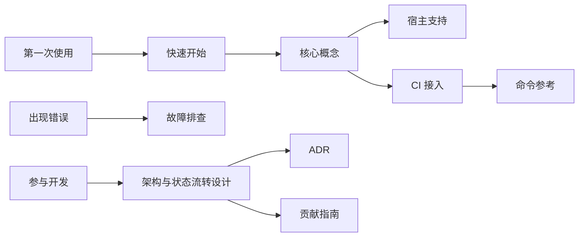

# Echo Semantic 文档

这里是 `echo-semantic` 的公共文档入口。第一次使用从“快速开始”进入；评估架构、接入 CI 或参与开发时按主题阅读。

## 使用文档

| 文档                             | 适合谁                          | 解决的问题                                         |
| -------------------------------- | ------------------------------- | -------------------------------------------------- |
| [快速开始](getting-started.md)   | 首次使用者                      | 安装插件、让项目采用语义基线、完成第一次受治理变更 |
| [核心概念](concepts.md)          | 使用者与 Reviewer               | 了解对象模型、风险视角、路由和状态权威             |
| [宿主支持](host-support.md)      | Codex、Cursor、Claude Code 用户 | 理解三端能力、生命周期差异和验证等级               |
| [CI 接入](ci-integration.md)     | 项目维护者                      | 把确定性语义校验加入 GitHub Actions                |
| [命令参考](command-reference.md) | 维护者与自动化作者              | 查询安装器、探测、路由、预检、状态和验证命令       |
| [故障排查](troubleshooting.md)   | 遇到安装或门禁问题的用户        | 根据错误定位缓存、Hook、快照、引用和路径分类问题   |
| [常见问题](faq.md)               | 评估采用者                      | 判断插件边界、适用项目和与其它工程流程的关系       |
| [发布指南](releasing.md)         | 项目维护者                      | 管理版本、发布证据、宿主验收和回滚                 |

## 设计与维护

| 文档                                                                                 | 用途                                                 |
| ------------------------------------------------------------------------------------ | ---------------------------------------------------- |
| [项目架构与状态流转设计](supreme/specs/plugin-architecture/design.md)                | 完整架构、状态图、流程图、时序图、失败降级和验收标准 |
| [多宿主适配](multi-host-adapters.md)                                                 | 三端发现、Hook、Agent 和安装投影差异                 |
| [ADR 0001](adr/0001-multi-host-layered-enforcement.md)                               | 记录分层语义治理架构的选择理由                       |
| [语义材料合同](../skills/semantic-contract/references/semantic-artifact-contract.md) | `semantic/` 对象、字段、引用、快照和高风险门禁规范   |
| [贡献指南](../CONTRIBUTING.md)                                                       | 开发环境、边界、验证和 Pull Request 要求             |
| [安全说明](../SECURITY.md)                                                           | 本地威胁模型、敏感信息边界和漏洞报告方式             |
| [社区行为规范](../CODE_OF_CONDUCT.md)                                                | 公共讨论和协作行为要求                               |
| [变更记录](../CHANGELOG.md)                                                          | 发布能力和不兼容变化记录                             |

## 阅读路径

文档中的“通过”必须带范围。静态 manifest 通过不代表 Hook 已在真实会话运行，语义合同通过也不代表业务正确或没有缺陷。
