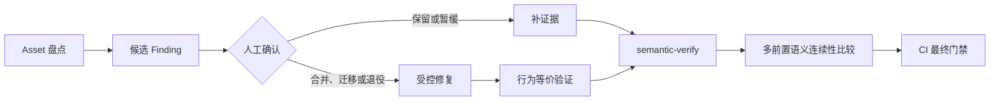
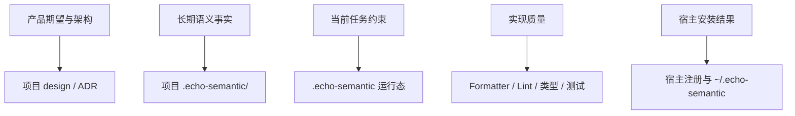

# 核心概念

`echo-semantic 0.3.0` 将“需要模型判断的语义工作”与“可以机器确定的结构和 Git 事实”分开。理解这条边界，是正确使用插件的前提。

## 四层约束

老项目整合路径在这四层之内按以下顺序收敛：

| 层     | 能解决什么                                   | 不能证明什么                 |
| ------ | -------------------------------------------- | ---------------------------- |
| Skill  | 复用分析、边界识别、产品预期、风险假设       | 每次都被加载、工具一定被阻断 |
| Hook   | 会话注入、编辑范围检查、压缩恢复、停止前校验 | 所有宿主和配置中一定触发     |
| 校验器 | 对象结构、快照、引用、路径分类、变更依据     | 业务正确、审查充分、没有缺陷 |
| CI     | 在独立环境重跑最终门禁                       | 替代项目自己的工程测试       |

## 语义对象

| 对象           | 用途             | 典型内容                                               |
| -------------- | ---------------- | ------------------------------------------------------ |
| Baseline       | 仓库级入口       | 源码快照、路径区域、边界、覆盖网格和闭合状态           |
| Capability Map | 能力导航         | 场景、入口、输出、状态流、策略和相关对象               |
| Behavior       | 重要行为承诺     | 当前行为、期望行为、失败恢复和证据                     |
| Rule           | 不变量或唯一权威 | 状态权威、优先级、不可同时成立的约束                   |
| Evidence       | 可复用事实证据   | 源码、测试、契约和运行证据及其限制                     |
| Finding        | 可处置问题       | 触发条件、影响、修复和验证证据                         |
| Audit          | 定向审查记录     | 指定 revision、边界、风险视角和故障假设                |
| Discovery      | 发现过程证据     | 扫描范围、候选事实、归并结果和未知项                   |
| Asset          | 语义资产清单     | 文件、符号、入口、状态权威、协议、测试消费者和文档身份 |

对象使用带 YAML 前置元数据的 Markdown。完整字段见 [语义材料合同](../skills/semantic-contract/references/semantic-artifact-contract.md)。

## 八个风险视角

每个中高风险边界都应考虑以下视角：

| 风险视角              | 关注问题                                       |
| --------------------- | ---------------------------------------------- |
| `trigger_input`       | 谁触发、输入从哪里进入、如何校验               |
| `result_side_effect`  | 产生哪些返回值、写入和外部副作用               |
| `state_authority`     | 哪个组件拥有最终状态，是否存在双写或平行真理源 |
| `data_durability`     | 数据写到哪里，何时持久化、清理或迁移           |
| `time_lifecycle`      | 启动、恢复、超时、停止和跨会话行为             |
| `failure_concurrency` | 失败、重试、取消、并发和恢复是否闭合           |
| `permission_external` | 权限、敏感信息和外部系统交互                   |
| `contract_evidence`   | 公共契约、测试和证据能证明什么                 |

## 闭合状态

Baseline 有两个独立闭合字段：

- `inventory_closure`：Git 路径、边界和风险视角是否都有明确去向；
- `behavior_model_closure`：重要能力场景、行为、规则和证据是否充分展开。

`closed` 不表示“安全”或“没有缺陷”。新路径未分类、引用失效或证据过期时，校验器仍会失败。

## 六类路由

| 路由          | 含义                               | 典型变化                                   |
| ------------- | ---------------------------------- | ------------------------------------------ |
| `bootstrap`   | 基线、宿主能力或 Hook 事件证据不足 | 首次采用、宿主未探测到、Stop 尚未真实触发  |
| `idle`        | 当前没有工作树变化                 | 明确任务开始前                             |
| `maintenance` | 没有明确任务且没有工作树变化       | 插件单独触发时对全仓已完成代码做语义维护   |
| `fast`        | 低风险快速路径                     | 文档、配置、测试、示例                     |
| `standard`    | 一般差异，需要影响分析             | 非生产源码且不全是快速路径                 |
| `strict`      | 高风险边界，需要同次证据和定向审查 | 生产源码、未知源码、协议、迁移、治理控制面 |

路由是根据当前事实重新计算的短期结果，不是项目任务状态机。没有明确任务时使用 `maintenance`，建议执行全仓
`semantic-discover`、`semantic-status`、`semantic-consolidate`、`semantic-audit` 和 `semantic-verify`；存在任务预检时只处理允许路径。
差异出现后风险可以升级，不能因为生成前判断为低风险而强制降级。

## 三类短期状态

| 状态         | 位置                               | 约束                                                         |
| ------------ | ---------------------------------- | ------------------------------------------------------------ |
| Preflight    | `.echo-semantic/preflight.json`    | 绑定仓库、HEAD、任务，最长 24 小时                           |
| Route        | `.echo-semantic/route.json`        | 绑定宿主探测、Hook 事件证据、HEAD 和工作树摘要，最长 24 小时 |
| Continuation | `.echo-semantic/continuation.json` | 绑定任务、分支和证据摘要，最长 7 天                          |

这些文件不提交 Git，不定义项目架构。它们损坏或失效时，系统回到重新预检、重新路由或无恢复提示状态。

Route 还会保存完整工作树内容指纹和成功 Stop 的 `verificationReceipt`。收据只用于同一未变化工作树的宿主重入幂等，不能替代新的语义验证。

## 单一权威

同一个事实不能同时由两套材料拥有：

- 设计与 ADR 决定“应该怎样”；
- 源码与机器契约说明“现在怎样”；
- `.echo-semantic/` 连接行为、规则与证据；
- 工程工具决定代码是否满足格式、类型和测试要求；
- 预检和继续包只约束当前任务。

## Finding、Audit 与裁决

Audit 必须绑定“边界 × 风险视角 × revision”，并提出可被反证的故障假设。Finding 只有具备修复、验证和复审证据时才能
标记为 `resolved`；接受残余风险必须引用人的明确裁决。

`semantic-decide` 只处理证据无法替代的问题，例如兼容性取舍、产品预期冲突和风险接受。普通技术问题应继续调查，不要过早交给人裁决。
