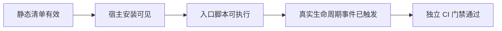

# 宿主支持

`echo-semantic` 共享同一套 Skill、语义合同和运行时逻辑，Codex、Cursor、Claude Code 只在发现、事件名称、输出字段和安装投影上不同。

## 能力矩阵

| 能力           | Codex                       | Cursor                       | Claude Code                  |
| -------------- | --------------------------- | ---------------------------- | ---------------------------- |
| 插件发现       | `.codex-plugin/plugin.json` | `.cursor-plugin/plugin.json` | `.claude-plugin/plugin.json` |
| Skill          | manifest                    | manifest                     | manifest / 插件目录          |
| 专用 Agent     | 用户 TOML 投影              | 原生 `agents/`               | 原生插件 Agent               |
| SessionStart   | 支持                        | 支持                         | 支持                         |
| 编辑前路径检查 | 当前未稳定覆盖              | `preToolUse`                 | `PreToolUse`                 |
| PreCompact     | 降级支持，需真实会话验证    | 降级支持，需真实窗口验证     | 支持，需登录会话验证         |
| Stop           | 支持                        | 支持                         | 支持                         |
| 安装方式       | CLI + 用户 Hook/Agent 投影  | 本地插件链接                 | Marketplace CLI              |

该表中的“支持”首先表示项目具有对应适配代码和静态合同，不自动等于当前用户机器已经触发真实生命周期事件。

## 验证等级

宿主能力应按以下等级报告，不能混用：



| 等级         | 能证明什么                         | 不能证明什么           |
| ------------ | ---------------------------------- | ---------------------- |
| 静态清单     | JSON、路径和事件名称符合当前合同   | 宿主已经加载           |
| 安装可见     | 宿主列表中存在并启用插件           | Hook 已运行            |
| 入口可执行   | 缓存内 Hook 能处理样例输入         | 宿主一定发送真实事件   |
| 真实生命周期 | 指定版本、配置和信任状态下收到事件 | 其它机器和版本同样成立 |
| CI           | 最终 Git 差异通过确定性门禁        | 业务没有缺陷           |

## Codex

### 安装

```bash
node bin/install.mjs install codex
```

安装器会：

1. 删除当前 `echo-semantic` 和旧 ID 的插件、marketplace 注册；
2. 从当前仓库重新添加 marketplace；
3. 安装 `echo-semantic@echo-semantic`；
4. 把三个只读 Agent 投影到 `~/.codex/agents/`；
5. 合并 SessionStart、PreCompact、Stop 到 `~/.codex/hooks.json`；
6. 写入 `~/.echo-semantic/install-state.json`。

验证：

```bash
codex plugin list --json
codex plugin marketplace list --json
```

Codex 当前没有稳定的编辑前 Hook，因此不会声称可以在每次写文件前阻断。写入范围由预检指导，Stop 和 CI 负责确定性收口。

## Cursor

### 安装

```bash
node bin/install.mjs install cursor
```

安装器将当前仓库链接到：

```text
~/.cursor/plugins/local/echo-semantic
```

安装后重新加载 Cursor 窗口。Cursor 使用 `sessionStart`、`preToolUse`、`preCompact` 和 `stop` 事件；字段名与 Claude Code 不同，
但都进入 `hooks/entry.mjs` 的共享逻辑。

## Claude Code

### 安装

```bash
node bin/install.mjs install claude-code
```

安装器通过 Claude Code Marketplace CLI 删除当前和旧 ID，再安装 `echo-semantic@echo-semantic`。安装后新建会话，并确保 CLI 已登录。

Claude Code 使用 `SessionStart`、`PreToolUse`、`PreCompact` 和 `Stop`。编辑前只匹配 `Edit|Write`，不会拦截只读工具。

## 共享事件映射

| 共享语义 | Codex          | Cursor         | Claude Code              |
| -------- | -------------- | -------------- | ------------------------ | ------ |
| 会话开始 | `SessionStart` | `sessionStart` | `SessionStart`           |
| 编辑前   | 暂无稳定覆盖   | `preToolUse`   | `PreToolUse`，匹配 `Edit | Write` |
| 压缩前   | `PreCompact`   | `preCompact`   | `PreCompact`             |
| 停止前   | `Stop`         | `stop`         | `Stop`                   |

宿主输出也不同：Cursor 使用 `additional_context`，Codex 和 Claude Code 使用 `hookSpecificOutput.additionalContext`。适配差异不得进入语义 Skill 正文。

## 能力探测

```bash
npm run probe
```

探测结果包含：

- `detected`：是否找到宿主命令或安装目录；
- `version`：可用时读取 `--version`；
- `skills`、`agents`、`hooks`：静态能力合同；
- `lifecycle.*.probe`：`passed`、`blocked` 或 `live-session-required`。

`passed` 目前只用于宿主启动探测。resume、compact 等必须保留 `live-session-required`，直到取得真实事件证据。

## 新增宿主

新增宿主适配前必须具备：

1. 官方合同、当前 CLI 帮助或真实加载证据；
2. `runtime/capabilities/<host>.json`；
3. manifest、安装/卸载和事件适配；
4. 静态合同、安装和生命周期测试；
5. 明确哪些能力仍需真实会话验收。

宿主适配器不能复制语义对象模型、风险路由或校验器实现。
