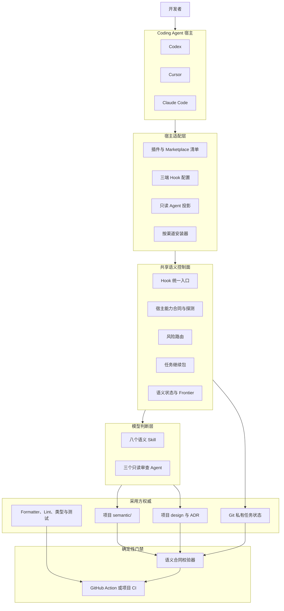
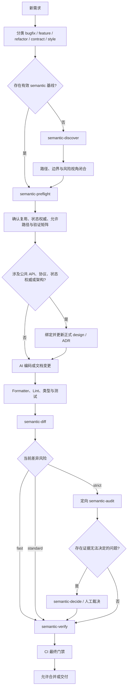
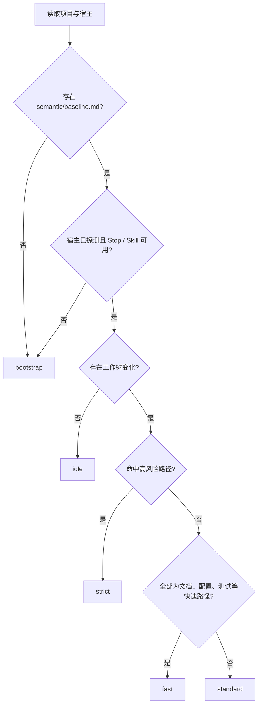
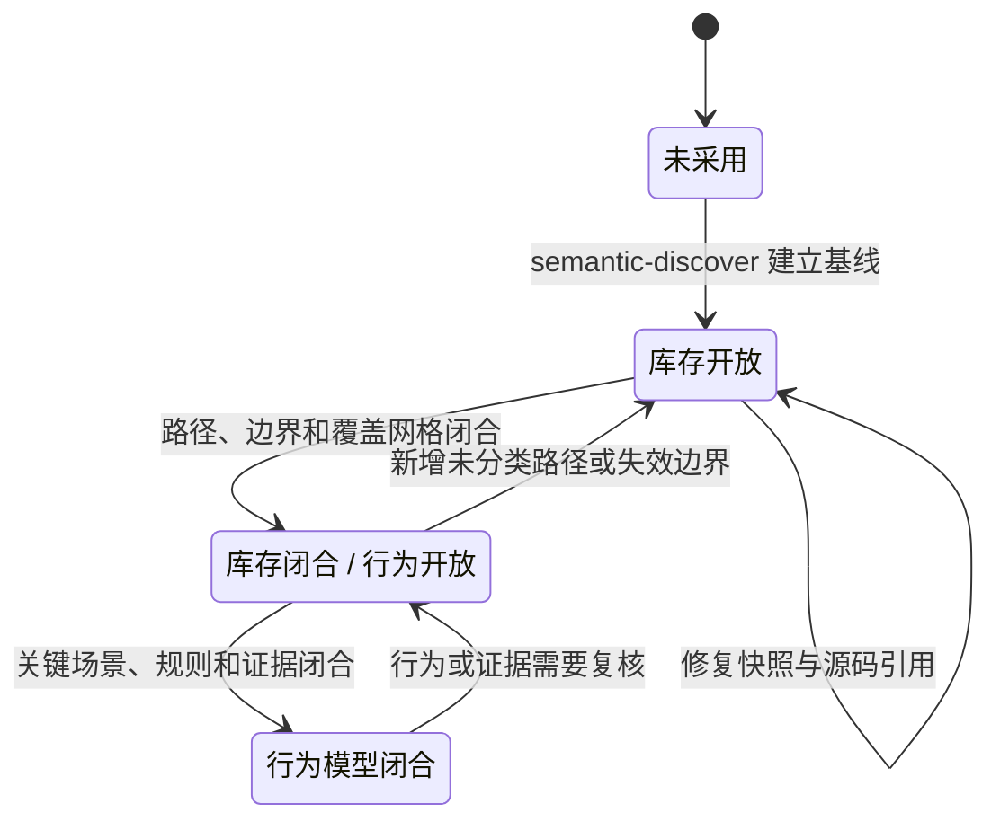
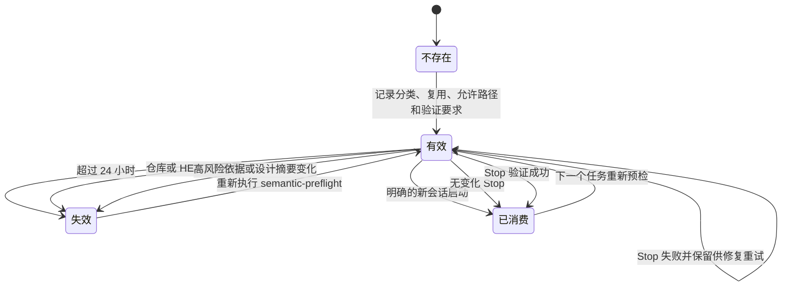
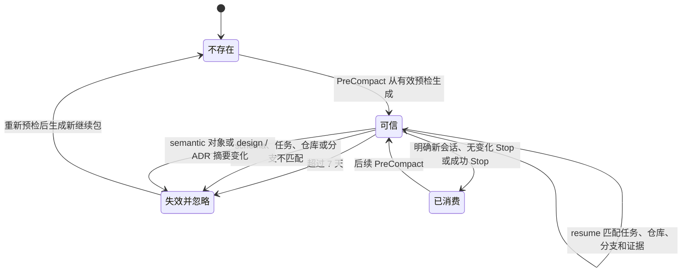
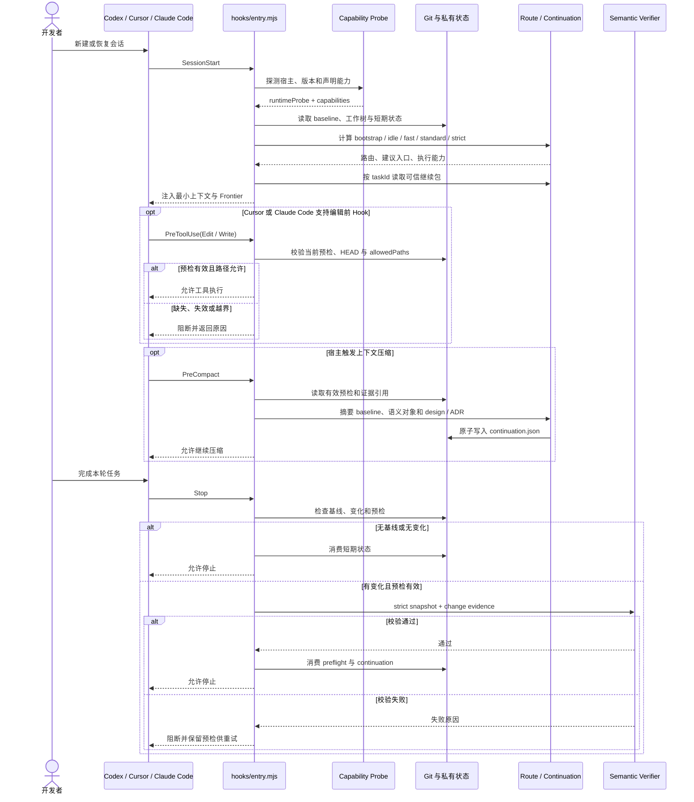
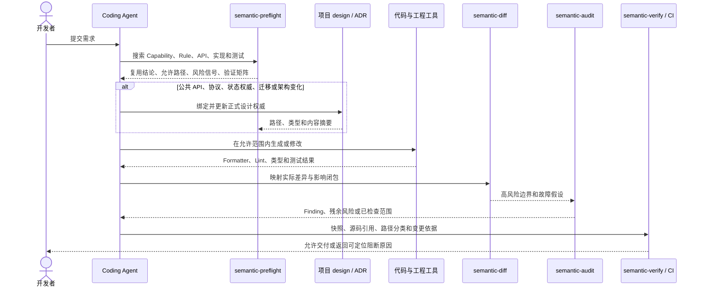
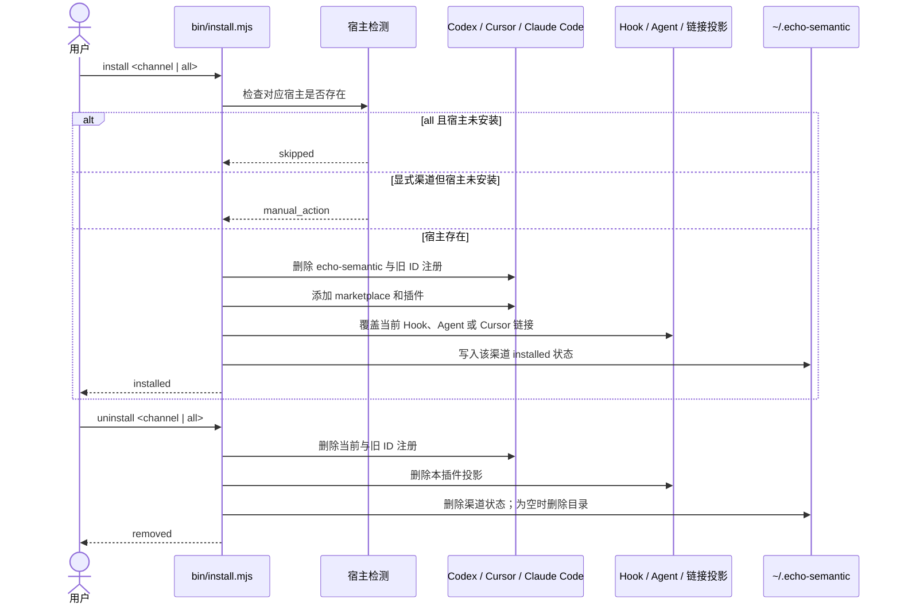

# Echo Semantic 项目架构与状态流转设计

## 文档定位

本文描述 `echo-semantic` 的完整目标架构和当前实现约束，是项目架构、状态流转、生命周期与失败降级的统一说明。

- [ADR 0001](../../../adr/0001-multi-host-layered-enforcement.md) 记录为什么采用“Skill 判断、Hook 接线、校验器与 CI 阻断”的架构决策；
- 本文描述该决策落地后的完整系统形态，不替代 ADR；
- [多宿主适配](../../../multi-host-adapters.md) 保存 Codex、Cursor、Claude Code 的适配差异；
- 采用方项目自己的 design/ADR 和 `semantic/` 仍是业务语义权威，插件文档不保存采用方事实。

## 问题与目标

单独依靠 Skill 只能影响模型当前一轮行为，无法证明 Skill 一定被加载，也无法在工具执行、上下文压缩和合并时提供确定性约束。
单独依靠 Hook 又不能完成能力复用、产品预期、状态权威和架构边界等需要语义判断的工作。

本项目的目标是建立一个项目无关的 Coding Agent 语义治理控制面：

1. 代码生成前确认复用关系、唯一状态权威、允许修改路径和验证矩阵；
2. 根据仓库基线、宿主能力和当前差异选择合适的治理深度；
3. 在宿主支持时，于编辑前阻断超出预检范围的写入；
4. 在上下文压缩前保存有证据约束的短期恢复线索；
5. 在任务停止和 CI 合并时重新执行确定性语义验证；
6. 让 formatter、Lint、类型、单元、契约和集成测试继续拥有实现质量权威。

## 目标行为

- 未采用语义基线的项目进入 `bootstrap`，先建立或修复 `semantic/`；
- 已采用项目必须在修改前拥有与当前仓库、HEAD 和任务匹配的 `semantic-preflight`；
- 文档、配置、测试等低风险变化走 `fast`，普通非源码变化走 `standard`，生产源码、协议、迁移和治理控制面变化走 `strict`；
- 高风险变化必须同时更新语义对象，架构类变化还必须绑定并更新正式 design/ADR；
- 任何短期状态失效都只能导致重新预检或降级，不能放宽编辑和停止门禁；
- Hook 缺失、宿主不支持或未取得真实会话证据时，由 Stop 和 CI 收口，不宣称完整运行时覆盖。

## 范围与非目标

### 范围

- Codex、Cursor、Claude Code 的插件清单、安装、Skill、只读 Agent 和 Hook 适配；
- Capability、Behavior、Rule、Evidence、Finding、Audit、Discovery 的 Markdown 合同；
- `semantic-preflight`、风险路由、任务继续包和状态汇总；
- 严格快照、源码引用、路径分类、高风险依据和 CI 变更门禁。

### 非目标

- 不提供数据库、常驻服务或独立任务执行器；
- 不替代 Coding Agent 的编码、规划和普通代码审查能力；
- 不把预检、路由或继续包升级为业务状态权威；
- 不复制采用方已有的 design/ADR、任务系统、测试系统或工程规范；
- 当前不提供 MCP Server；本地文件和 Git 足以完成现有确定性验证。

## 系统边界



宿主适配层只转换发现方式、事件名称、输入输出字段和安装投影。路由、状态合同、Skill 正文和语义对象模型只有一套共享实现。

## 仓库结构

```text
echo-semantic/
├── .agents/                    # Codex Marketplace
├── .codex-plugin/              # Codex 插件清单
├── .cursor-plugin/             # Cursor 插件清单
├── .claude-plugin/             # Claude Code 插件与 Marketplace 清单
├── agents/                     # 三个只读语义 Agent
├── bin/                        # 多宿主安装与卸载入口
├── hooks/                      # 三端事件配置和共享 Hook 入口
├── runtime/                    # 能力探测、风险路由和任务继续包
├── skills/                     # 八个语义 Skill 真理源
├── scripts/                    # 插件与设计合同校验
├── semantic/                   # 插件自身的语义基线
├── tests/                      # Node 与 Python 回归测试
├── docs/                       # 用户文档、设计和 ADR
├── action.yml                  # 可复用 GitHub Action
└── README.md                   # GitHub 项目入口
```

## 组件职责

| 组件       | 主要路径                                                           | 职责                                                     | 不拥有的内容                 |
| ---------- | ------------------------------------------------------------------ | -------------------------------------------------------- | ---------------------------- |
| 插件清单   | `.codex-plugin/`、`.cursor-plugin/`、`.claude-plugin/`、`.agents/` | 声明插件 ID、展示信息、Skill、Agent 和 Hook 入口         | 业务语义和路由策略           |
| 安装器     | `bin/install.mjs`                                                  | 检测宿主、按渠道安装/卸载、覆盖当前版本、清理旧 ID 投影  | 事务协调和业务状态           |
| Hook 入口  | `hooks/entry.mjs`                                                  | 统一解析三端事件，接入路由、编辑范围、压缩恢复和停止验证 | 语义判断和长期材料写入       |
| 能力矩阵   | `runtime/capabilities/`                                            | 保存静态宿主能力合同并探测当前安装与版本                 | 真实会话已经成功的结论       |
| 风险路由   | `runtime/route.mjs`                                                | 根据基线、宿主探测和 Git 差异计算治理深度                | 持久任务阶段和人工决策       |
| 继续包     | `runtime/continuation.mjs`                                         | 保存并校验短期任务恢复线索及证据摘要                     | 完整对话、审批状态和长期事实 |
| 状态视图   | `skills/semantic-status/`                                          | 汇总结构、新鲜度、开放问题和唯一下一入口                 | 完整语义验证结论             |
| 语义 Skill | `skills/`                                                          | 完成发现、预检、差异、审查、裁决和验证协作               | 宿主生命周期强制执行         |
| 只读 Agent | `agents/`                                                          | 独立探索边界、复核能力闭合、挑战高风险假设               | 长期材料写入权               |
| 校验器     | `skills/semantic-contract/scripts/verify_semantic.py`              | 校验快照、引用、分类、关系和高风险变更依据               | 业务预期裁决和代码风格       |
| CI Action  | `action.yml`                                                       | 在独立环境重跑最终语义门禁                               | 取代项目自己的工程测试       |

## 状态权威与存储

| 状态或材料                            | 位置                                   | 生命周期                         | 权威级别         | 失效策略                       |
| ------------------------------------- | -------------------------------------- | -------------------------------- | ---------------- | ------------------------------ |
| Capability、Behavior、Rule 等长期事实 | `semantic/`                            | 随 Git 版本演进                  | 项目语义唯一权威 | 摘要、引用或关系失效即阻断验证 |
| 产品与架构决策                        | 项目 design/ADR                        | 随 Git 版本演进                  | 产品和架构权威   | 内容摘要变化后重新绑定         |
| 任务预检                              | `.git/echo-semantic/preflight.json`    | 最长 24 小时、绑定当前 HEAD      | 当前任务写入合同 | 过期、仓库或 HEAD 不匹配即无效 |
| 风险路由                              | `.git/echo-semantic/route.json`        | 每次 SessionStart 或显式计算刷新 | 可丢弃计算结果   | 结构或时间无效时重新计算       |
| 任务继续包                            | `.git/echo-semantic/continuation.json` | 最长 7 天、绑定任务/分支/证据    | 可丢弃恢复线索   | 任一证据摘要变化即忽略         |
| 安装状态                              | `~/.echo-semantic/install-state.json`  | 用户级安装期间                   | 安装器记录       | 全部卸载后删除                 |
| 宿主注册与缓存                        | Codex、Cursor、Claude Code 用户目录    | 由宿主管理                       | 安装投影         | 重装覆盖，卸载撤回             |
| 工程验证结果                          | 项目工具与 CI                          | 每次变更重新产生                 | 实现质量权威     | 任何失败均不得以语义材料替代   |

Git 私有状态都是短期派生数据。删除它们最多要求重新预检、重新路由或丢失恢复提示，不会丢失项目长期语义事实。

## 主工作流



流程不是固定瀑布线。`semantic-status` 根据当前事实给出 Frontier；低风险任务可以跳过正式审查，风险只能在差异出现后升级，不能因早期判断而降级。

## 路由决策



| 路由        | 进入条件                                       | 推荐入口                                                | 必要收口                                           |
| ----------- | ---------------------------------------------- | ------------------------------------------------------- | -------------------------------------------------- |
| `bootstrap` | 无基线，或宿主探测/关键能力不可用              | `semantic-discover` 或 `semantic-preflight`             | `semantic-verify`                                  |
| `idle`      | 有基线且工作树无变化                           | `semantic-preflight`                                    | 新任务开始前重新记录预检                           |
| `fast`      | 只有文档、配置、测试、示例等低风险路径         | `semantic-preflight`                                    | 工程验证和 `semantic-verify`                       |
| `standard`  | 有变化但未命中高风险路径，且不全是快速路径     | `semantic-preflight`、`semantic-diff`                   | `semantic-verify`                                  |
| `strict`    | 生产源码、未知源码、协议、迁移或治理控制面变化 | `semantic-preflight`、`semantic-diff`、`semantic-audit` | 高风险依据、设计权威、工程验证和 `semantic-verify` |

静态能力矩阵只描述宿主声明能力。本次 `runtimeProbe` 未确认宿主存在时，路由必须进入 `bootstrap`，不能把静态清单当作真实运行证据。

## 状态流转

### 项目语义基线



`inventory_closure` 和 `behavior_model_closure` 只表达覆盖状态，不表示系统没有缺陷。任何未分类生产路径都会使严格验证失败。

### 任务预检



### 任务继续包



继续包不保存完整对话或审批状态。它只携带阶段、路由、已完成项、未决 Frontier、下一入口和受摘要保护的证据引用。

## 宿主生命周期时序



Codex 当前没有稳定的编辑前 Hook 覆盖，因此主要依靠 SessionStart、PreCompact、Stop 和 CI；Cursor、Claude Code 可在写入前增加即时路径阻断。

## 高风险变更时序



`semantic-decide` 只在源码、契约和测试都无法确定产品期望或风险接受时进入，不负责替代正式架构设计。

## 安装与卸载时序



安装器不实现跨宿主事务。`all` 中一个宿主失败不会回滚已经成功的其它宿主，每个结果独立返回。

## 数据流与信任边界

1. 宿主事件是触发输入，不是项目事实；`hooks/entry.mjs` 只提取工作目录、事件来源、工具路径和任务标识。
2. Git 提供仓库根、HEAD、分支、工作树差异和私有状态路径，是当前性与谱系依据。
3. `semantic/` 提供长期行为事实；源码与 design/ADR 提供实现和期望依据。
4. Skill 可以提出、归并和复核语义结论，但只有校验器能确定结构、引用、摘要和路径分类是否成立。
5. Hook 的成功只证明本地事件入口返回成功；CI 必须在独立环境重新读取最终差异。
6. 真实宿主能力需要版本、配置、信任和生命周期事件证据；静态 manifest 不能单独证明 Hook 已运行。

## 异常与降级

| 场景                             | 行为                                      | 是否放宽门禁                 |
| -------------------------------- | ----------------------------------------- | ---------------------------- |
| 当前目录不是 Git 仓库            | Hook 返回空结果，不创建项目状态           | 不适用                       |
| 项目没有 `semantic/baseline.md`  | 路由为 `bootstrap`；Stop 不阻断未采用项目 | 不建立伪基线                 |
| 宿主未探测到或关键能力未知       | 路由为 `bootstrap`                        | 否，最终依赖显式 Skill 和 CI |
| 预检缺失、过期、HEAD 不匹配      | 编辑前或 Stop 返回阻断原因                | 否                           |
| 编辑路径超出 `allowedPaths`      | 支持 PreToolUse 的宿主立即阻断            | 否                           |
| Codex 缺少稳定 PreToolUse        | 不做虚假即时阻断声明                      | 否，由 Stop 和 CI 收口       |
| 继续包损坏、过期或证据变化       | 忽略恢复包并重新判断 Frontier             | 否                           |
| 校验器或 `uv` 不可用             | Stop 失败并保留预检                       | 否                           |
| 语义摘要、源码引用或路径分类失效 | `semantic-verify` 和 CI 失败              | 否                           |
| 一个宿主安装失败                 | 返回该宿主 `failed`，保留其它宿主结果     | 不影响其它渠道               |
| Hook 未被宿主信任或未触发        | 不声称运行时已覆盖                        | 否，由 CI 提供最终信号       |

## 关键取舍

### Skill、Hook 与 CI 分层

Skill 适合语义判断，Hook 适合生命周期接线，脚本和 CI 适合确定性阻断。把所有判断写成脚本会失去语义能力，只写 Skill 又缺少强制力。

### 项目材料单一权威

长期事实只进入采用方 `semantic/`，正式产品和架构选择只进入采用方 design/ADR。插件不维护第二份跨项目知识库。

### 派生状态可丢弃

预检、路由和继续包位于 Git 私有目录，绑定仓库事实并设置有效期。它们用于约束当前任务和恢复上下文，不进入版本控制。

### 按风险控制深度

所有任务都保留生成前和生成后收口，但只有高风险差异才要求定向 Audit 和正式设计依据，避免把轻量修改变成固定重流程。

### 不引入常驻控制服务

当前状态只需本地文件、Git 和短进程完成。数据库、daemon 和 MCP 会增加部署与状态一致性成本，但没有提供当前场景必需的新能力。

## 复用与实现约束

- 复用宿主原生插件、marketplace、Skill、Agent 和 Hook 机制，不建设自有插件运行时；
- 复用 Git 的 revision、branch、diff 和私有路径，不建设独立版本系统；
- 复用采用方 formatter、Lint、类型、测试和 CI，不在语义 Skill 中模拟代码质量工具；
- 复用正式 design/ADR，`semantic-decide` 不创建第二套架构仓库；
- 三端适配器保持薄，只处理事件和路径映射；共享运行时不得复制三份实现；
- 新增宿主能力前必须获得官方合同、当前 CLI 或真实加载证据，未知能力默认保守降级。

## 权限与敏感信息

- 插件只读取当前仓库、Git 私有状态和宿主本地配置，不上传项目内容；
- 验收探针只有显式设置环境变量时才写入事件元数据；
- 继续包只记录路径引用和摘要，不记录文件正文、完整对话、密钥或工具输出；
- 三个专用 Agent 以只读模式投影；
- 安装器只撤回当前插件 ID 和显式旧 ID 的注册与路径，不扫描删除其它插件内容。

## 验收标准

1. README 能在不阅读源码的情况下说明定位、架构层次、主工作流、状态权威和文档入口；
2. 正式设计包含架构图、任务流程图、路由图、状态图、生命周期时序图和安装时序图；
3. 图中的组件、事件、状态文件、有效期和失败行为与当前实现一致；
4. 三端 manifest 继续指向同一组 Skill、Agent 和 Hook 真理源；
5. `npm run verify` 通过格式、静态合同、Node/Python 测试、校验器自测和严格快照；
6. 高风险变更仍需执行 `--require-change-evidence`，文档不能成为绕过机器门禁的依据；
7. Codex、Cursor、Claude Code 的真实生命周期验收与静态清单验证分开报告。

## 已知限制

- Codex 当前缺少稳定的编辑前 Hook 覆盖；
- Cursor 仍需要窗口重载后的真实插件与 Hook 验收；
- Claude Code 仍需要登录后的完整模型会话验收；
- Mermaid 图由文档渲染器呈现，纯文本环境仍以相邻表格和正文为准。
